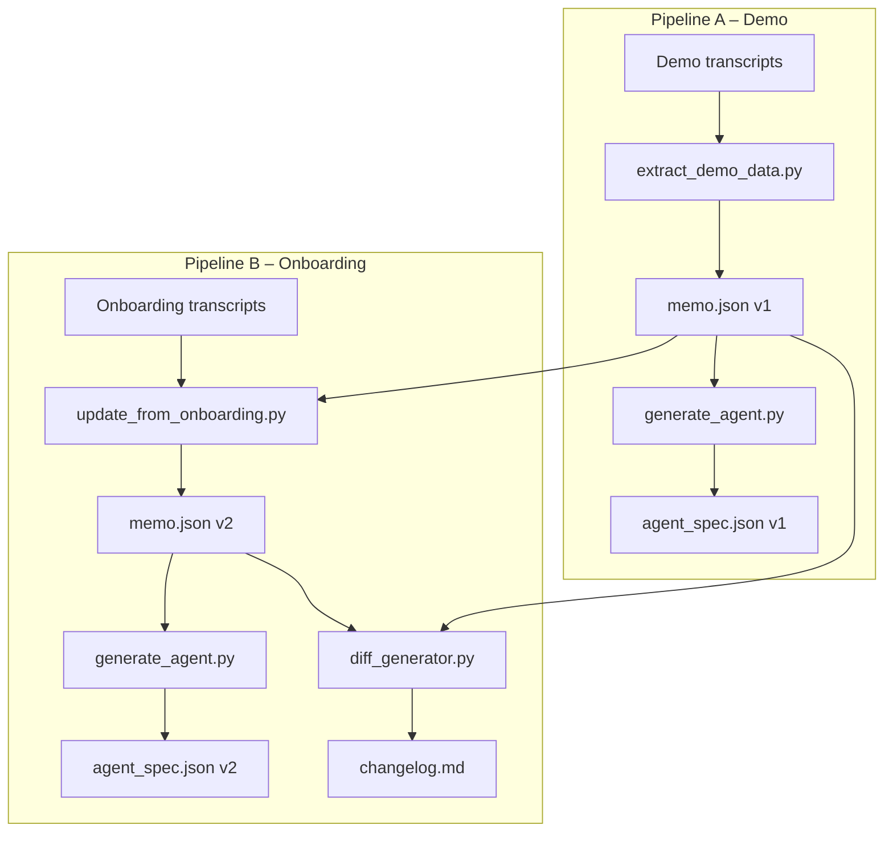

# Clara Answers Onboarding Automation

> **Zero-cost, local-only pipeline** that converts demo and onboarding call transcripts into structured account data and Retell AI–ready voice agent configurations.

---

## Table of Contents

- [Quick Start](#quick-start)
- [Project Overview](#project-overview)
- [Goal of the System](#goal-of-the-system)
- [System Architecture](#system-architecture)
- [Project Folder Structure](#project-folder-structure)
- [Pipeline A: Demo Processing](#pipeline-a-demo-processing)
- [Pipeline B: Onboarding Update](#pipeline-b-onboarding-update)
- [Account Memo & Agent Spec](#account-memo--agent-spec)
- [Example Outputs](#example-outputs)
- [Versioning & Change Tracking](#versioning--change-tracking)
- [Idempotency & Batch Processing](#idempotency--batch-processing)
- [No Hallucination Policy](#no-hallucination-policy)
- [Running Locally](#running-locally)
- [n8n Automation](#n8n-automation-workflow)
- [Using the Agent in Retell](#using-the-generated-agent-in-retell)
- [Limitations](#limitations)
- [Future Improvements](#future-improvements)
- [What This Project Demonstrates](#what-this-project-demonstrates)

---

## Quick Start

| Step | Action |
|------|--------|
| 1 | Put **demo** transcripts in `dataset/demo_calls/` as `ACCOUNTID_demo_*.txt` |
| 2 | Run **Pipeline A**: `python scripts/extract_demo_data.py` → creates v1 memo + agent spec |
| 3 | Put **onboarding** transcripts in `dataset/onboarding_calls/` as `ACCOUNTID_onboarding_*.txt` |
| 4 | Run **Pipeline B**: `python scripts/update_from_onboarding.py` → creates v2 memo + agent spec + changelog |

**Outputs** for each account live under `outputs/accounts/<ACCOUNT_ID>/` (v1/, v2/, changelog.md).

---

## Project Overview

**Clara Answers Onboarding Automation** converts:

- **Demo call transcripts** → structured **Account Memo** (v1) + **Retell-style agent config** (v1)
- **Onboarding call transcripts** → updated **Account Memo** (v2) + **agent config** (v2) + **changelog** (v1 → v2)

The system runs **offline** using **Python**, **local files**, and optional **n8n**. **No paid APIs** are used.

---

## Goal of the System

- Ingest **demo and onboarding call transcripts** for multiple accounts  
- Extract **operational configuration** (hours, routing, flows, constraints) into stable JSON  
- Generate **Retell AI–ready voice agent specs** with production-style system prompts  
- Track **configuration versions** (v1 from demo, v2 from onboarding) with clear change logs  
- Keep processing **modular**, **reproducible**, **batch-capable**, and **idempotent** with a strict **no-hallucination** policy  

---

## System Architecture

- **Inputs**: Transcripts in `dataset/demo_calls/` and `dataset/onboarding_calls/`
- **Scripts**: Parse → memo → agent spec → diff/changelog (see diagram below)
- **Outputs**: Per-account folders under `outputs/accounts/<ACCOUNT_ID>/` (v1/, v2/, changelog.md)
- **Optional**: n8n workflow to run both pipelines from a single trigger

### Architecture Diagram



---

## Project Folder Structure

```
project-root/
├── dataset/
│   ├── demo_calls/           # ACCOUNTID_demo_*.txt
│   └── onboarding_calls/     # ACCOUNTID_onboarding_*.txt
├── outputs/
│   └── accounts/
│       └── <ACCOUNT_ID>/
│           ├── v1/
│           │   ├── memo.json
│           │   └── agent_spec.json
│           ├── v2/
│           │   ├── memo.json
│           │   └── agent_spec.json
│           └── changelog.md
├── schemas/
│   ├── account_memo.schema.json
│   └── agent_spec.schema.json
├── scripts/
│   ├── extract_demo_data.py      # Pipeline A
│   ├── update_from_onboarding.py # Pipeline B
│   ├── generate_agent.py
│   ├── diff_generator.py
│   ├── models.py
│   ├── text_parsers.py
│   └── io_utils.py
├── workflows/
│   └── n8n_workflow.json
└── README.md
```

---

## Pipeline A: Demo Processing

**Input:** `dataset/demo_calls/*.txt` (filenames: `ACCOUNTID_demo_*.txt`; prefix = account_id)

**Script:** `scripts/extract_demo_data.py`

- Aggregates demo transcripts per account  
- Extracts (via `text_parsers.py`): company name, business hours, address, services, emergency definition, routing rules, transfer rules, integration constraints, flow summaries  
- Builds **AccountMemo** → writes `v1/memo.json`  
- Registers missing/ambiguous data in **questions_or_unknowns**  
- Generates **AgentSpec** → writes `v1/agent_spec.json`  

**Outputs:** `outputs/accounts/<ACCOUNT_ID>/v1/memo.json`, `v1/agent_spec.json`  

Re-running with the same inputs overwrites v1 artifacts (idempotent).

---

## Pipeline B: Onboarding Update

**Input:** `dataset/onboarding_calls/*.txt` (`ACCOUNTID_onboarding_*.txt`) + existing `v1/memo.json`

**Script:** `scripts/update_from_onboarding.py`

- Loads v1 memo, aggregates onboarding transcripts per account  
- Applies **conservative updates**: overwrites scalars only when new info is present; merges lists without duplication  
- Rebuilds **questions_or_unknowns**  
- Writes `v2/memo.json`, generates `v2/agent_spec.json`  
- Runs **diff_generator** v1 vs v2 → writes `changelog.md`  

**Outputs:** `v2/memo.json`, `v2/agent_spec.json`, `changelog.md`  

Idempotent for the same v1 + onboarding inputs.

---

## Account Memo & Agent Spec

### Account Memo (`memo.json`)

Schema: `schemas/account_memo.schema.json`. Key fields:

| Field | Description |
|-------|-------------|
| `account_id` | From transcript filenames |
| `company_name` | Practice/business name |
| `business_hours` | As stated in calls |
| `office_address` | Primary address |
| `services_supported` | List from transcripts |
| `emergency_definition` | How emergency is defined |
| `emergency_routing_rules` / `non_emergency_routing_rules` | Routing behavior |
| `call_transfer_rules` | Transfer logic |
| `integration_constraints` | EHR/CRM/PM notes |
| `after_hours_flow_summary` / `office_hours_flow_summary` | Flow descriptions |
| **`questions_or_unknowns`** | Missing/uncertain items (no guessing) |
| `notes` | Extra implementation notes |

### Agent Spec (`agent_spec.json`)

Schema: `schemas/agent_spec.schema.json`. Key fields:

| Field | Description |
|-------|-------------|
| `agent_name` | e.g. `"<Company> Answering Agent"` |
| `voice_style` | e.g. `"friendly-professional"` |
| `version` | `"v1"` or `"v2"` |
| `timezone` | From transcripts or `"UNKNOWN_TIMEZONE_FROM_TRANSCRIPTS"` |
| `business_hours` | From memo |
| **`system_prompt`** | Full prompt (business + after-hours flows, no internal tools) |
| `call_transfer_protocol` / `fallback_protocol` | Transfer and failure handling |

The **system prompt** encodes: greeting → purpose → name/phone → emergency vs non-emergency → route/transfer → fallback → “anything else?” → polite close (for both office-hours and after-hours).

---

## Example Outputs

Example account: **acme**.

### v1 Memo (excerpt)

```json
{
  "account_id": "acme",
  "company_name": "ACME Dental Care",
  "business_hours": "from 9am to 5pm Monday through Friday",
  "office_address": null,
  "services_supported": ["appointment scheduling, rescheduling, cancellations, and basic billing questions"],
  "emergency_routing_rules": "For emergencies, we transfer calls directly to our on-call doctor.",
  "questions_or_unknowns": [
    "office_address: Office address not clearly stated in demo calls.",
    "emergency_definition: Emergency definition not clearly stated in demo calls."
  ]
}
```

### v2 Memo (excerpt – updated fields)

```json
{
  "business_hours": "8am to 6pm Monday through Thursday, and 9am to 1pm on Friday",
  "office_address": "123 Main Street, Suite 400, Springfield.",
  "office_hours_flow_summary": "During business hours, emergencies should be transferred immediately to the clinical lead at the front desk."
}
```

### v1 Agent Spec (excerpt)

```json
{
  "agent_name": "ACME Dental Care Answering Agent",
  "voice_style": "friendly-professional",
  "version": "v1",
  "timezone": "UNKNOWN_TIMEZONE_FROM_TRANSCRIPTS",
  "call_transfer_protocol": "Follow the routing rules in the system prompt; if in doubt, collect details and promise a callback.",
  "fallback_protocol": "If a call transfer fails or information is missing, apologize, explain that you will take a detailed message, and confirm that a human from the business will follow up using the caller's preferred contact."
}
```

### Changelog (`changelog.md`)

```markdown
v1 → v2 changes

- Business hours updated
- Office address updated
- After-hours flow summary updated
- Office-hours flow summary updated
```

---

## Versioning & Change Tracking

- **v1**: From demo calls (Pipeline A); stored in `outputs/accounts/<ACCOUNT_ID>/v1/`
- **v2**: From onboarding on top of v1 (Pipeline B); stored in `v2/`
- **changelog.md**: High-level diff (e.g. “Business hours updated”, “Emergency routing changed”, “New integration constraint(s) added”)  

Generated by `diff_generator.py` comparing v1 and v2 memos.

---

## Idempotency & Batch Processing

- **Idempotent**: Same inputs → same outputs; re-runs overwrite JSON with identical content. No randomness or timestamps in generated data.
- **Batch**: All accounts in `dataset/` are processed in one run; each gets its own folder under `outputs/accounts/`.

Safe for repeated runs (e.g. nightly batch).

---

## No Hallucination Policy

- **Extraction**: Values are set only when **explicitly stated** in transcripts. Otherwise fields stay empty/`null`.
- **questions_or_unknowns**: Every missing or unclear field gets a descriptive line (e.g. `"business_hours: Business hours not clearly stated after onboarding."`) so humans see gaps instead of invented values.
- **Agent prompt**: Known gaps are listed in the system prompt; the agent is told to **acknowledge missing info**, collect details, and avoid promising anything not in config.

Configuration is grounded only in actual transcript content.

---

## Running Locally

### Prerequisites

- **Python 3.9+**
- Repository cloned locally

### Steps

1. **Place transcripts**
   - Demo: `dataset/demo_calls/ACCOUNTID_demo_*.txt` (e.g. `acme_demo_1.txt`)
   - Onboarding: `dataset/onboarding_calls/ACCOUNTID_onboarding_*.txt` (e.g. `acme_onboarding_1.txt`)

2. **Run Pipeline A** (from project root):

   ```bash
   python scripts/extract_demo_data.py
   ```

3. **Run Pipeline B**:

   ```bash
   python scripts/update_from_onboarding.py
   ```

Result: v1 and v2 memos + agent specs + changelog under `outputs/accounts/<ACCOUNT_ID>/`. Re-run anytime; outputs are deterministic.

---

## n8n Automation Workflow

File: **`workflows/n8n_workflow.json`**

- **Manual Trigger** → **Run Demo Pipeline** (`python scripts/extract_demo_data.py`) → **Run Onboarding Pipeline** (`python scripts/update_from_onboarding.py`).

Import the JSON into n8n, set the working directory in the Execute Command nodes to the project root, and run end-to-end on demand or on a schedule.

---

## Using the Generated Agent in Retell

`agent_spec.json` is a **Retell-style abstraction**. Map it into Retell as follows:

- **agent_name** → Retell agent name  
- **voice_style** → Voice selection  
- **timezone** / **business_hours** → Scheduling/availability  
- **system_prompt** → Retell system/instructions  
- **call_transfer_protocol** / **fallback_protocol** → Call flows, webhooks, or integrations  

This project does **not** call Retell APIs. Use it to generate and review configs, then copy into Retell’s UI or your own integration. Use `changelog.md` and `questions_or_unknowns` to resolve open questions before deployment.

---

## Limitations

- **Parsing**: Rule-based (regex/heuristics). May miss details or require similar phrasing; prefers marking unknowns over guessing.
- **Retell**: Spec is a generic v1-style model; you may need to align fields with the current Retell API/UI.
- **Audio**: Expects **text transcripts**; no built-in Whisper/audio step (can be added separately).

---

## Future Improvements

- Richer extraction (e.g. local LLM/NLP) while keeping the no-hallucination rule; optional confidence scores for review.
- Align `agent_spec.schema.json` with official Retell config; output deploy-ready JSON.
- CLI or UI to review/edit memo and agent_spec before deployment.
- Unit tests and JSON schema validation on each run.

---

## What This Project Demonstrates

- Turning **raw demo/onboarding conversations** into **structured operational data** with clear schemas  
- Generating **production-style AI voice agent configs** (Retell-compatible) from that data  
- **No-hallucination**: surfacing unknowns instead of inventing values  
- **Modular, idempotent, batch-ready** pipelines (optionally orchestrated with n8n)  
- A clear **versioning and change-tracking** path from demo → onboarding → deployment-ready agent  
